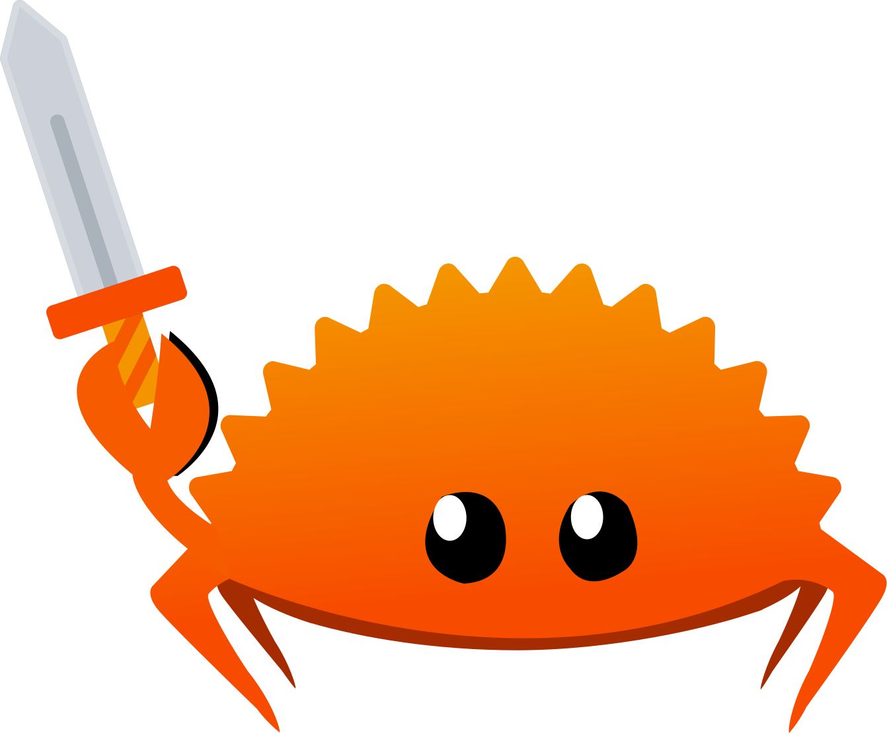

# Source for Rust Quest

> Learn programming in a new way!

With this book you'll learn how to program from scratch, all skill levels (even zero) are welcome!  
You'll complete quests and eventually become the best adventurer ever!

[If you want to try it out, click here to start your journey!](https://lyonsyonii.github.io/rust-quest/first-steps/1-introduction)

## Why Rust?

I believe that Rust is a very strict and thorough teacher, that will make sure you understand what your code does before even letting you execute it.  
This may seem undesirable at first, but the truth is that this strictness will make you a better programmer, a programmer that writes code that "works the first time".

I've also chosen Rust because it's conceived as a language with a very steep learning curve, and not recommended as a first language.  
Well, my mission here is to demonstrate the opposite!

## Contributing

Feel free to open a PR if you find any error!  
Translations are also welcome.

## Tooling

This book has been made possible thanks to [Astro](https://astro.build/), [Starlight](https://starlight.astro.build/) and [Svelte](https://svelte.dev/).

## License

Rust Quest is licensed under CC BY-NC-SA 4.0.  
It allows redistribution and modification for noncommercial use.  
To view a copy of this license, visit http://creativecommons.org/licenses/by-nc-sa/4.0/
